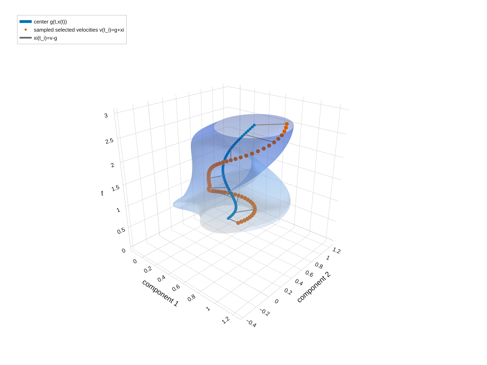
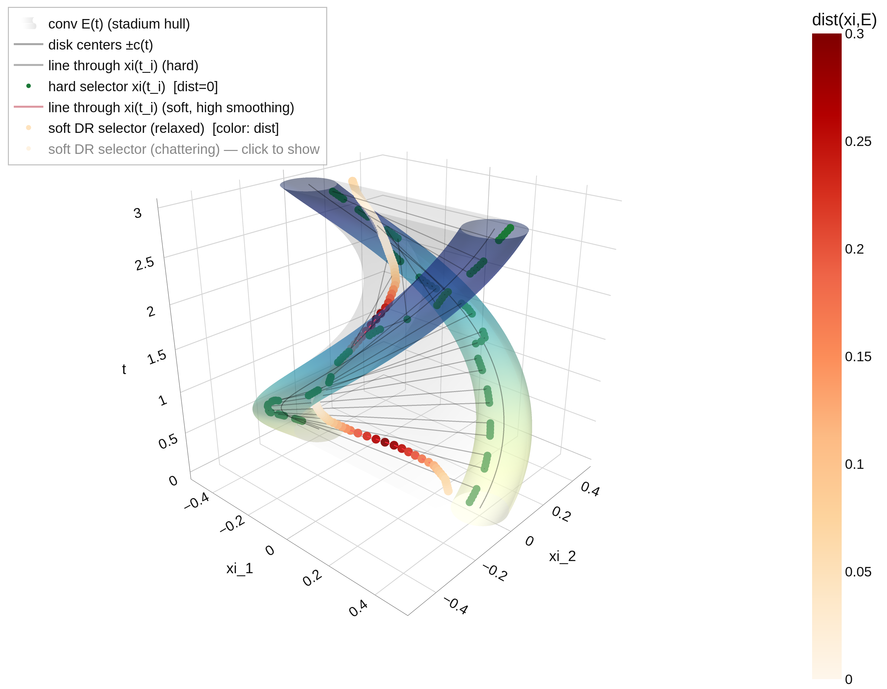

# PINNs for Differential Inclusions

**Distance-Residual Physics-Informed Neural Networks (DR-PINNs) for differential and partial differential inclusions.**

This repository contains research code, reproducible numerical examples, theoretical notes, and publication-ready figures for extending Physics-Informed Neural Networks (PINNs) from differential equations to **set-valued differential laws**.

> **Project status:** active research repository. The current code is organized as a replication package for numerical examples and figure generation; it is not yet an installable Python library.

## Overview

Classical PINNs assume that the governing law is an equality,

$$
D(u)=f.
$$

Differential inclusions replace the single right-hand side by a set of admissible values,

$$
D(u)\in F(u).
$$

For example, an ordinary differential inclusion has the form

$$
\dot{x}(t)\in F(t,x(t)), \qquad x(0)=x_0.
$$

Because there is no unique value to subtract from $D(u)$, the classical pointwise residual is replaced by the squared distance to the admissible set:

$$
R(u_\theta)(z) = \text{dist}^2  \left(D(u_\theta)(z),F(u_\theta)(z)\right).
$$

The corresponding DR-PINN loss is

$$
\mathcal{L}(\theta) = \frac{1}{N}\sum_{i=1}^{N} \text{dist}^2 \left( D(u_\theta)(z_i),F(u_\theta)(z_i) \right).
$$

The residual vanishes exactly when the differential inclusion is satisfied. For closed convex admissible sets, the metric projection is unique and

$$
\nabla_v\text{dist}^2(v,C) = 2\bigl(v-\Pi_C(v)\bigr),
$$

which makes the loss suitable for gradient-based optimization.

## Repository contents

```text
pinns-for-differential-inclusions/
├── README.md
├── LICENSE
├── paper/
│   ├── dr-pinns.tex          # manuscript (single source of truth)
│   ├── dr-pinns.pdf          # compiled draft for co-authors
│   └── figures/              # exactly the PNGs referenced by dr-pinns.tex
├── code/
│   ├── src/
│   │   ├── paper_style.py                          # shared matplotlib style (CM serif 14pt, dpi=180)
│   │   ├── dr_pinn_linear_control_qp_quickhull.ipynb   # Experiment 1 (Sec. 6.1)
│   │   ├── dr_pinn_relay_parabolic_experiment.ipynb    # Experiment 3 (Sec. 6.3)
│   │   └── tf_distance_residual_pinn_inclusion.{ipynb,py}  # legacy scalar experiment (not in paper)
│   └── results/
│       ├── results_linear_control_qp_quickhull/
│       ├── results_parabolic_case/
│       └── results_tf_distance_residual_pinn/
├── notes/
│   ├── notes_convex/
│   │   ├── rotating_ellipse_inclusion_convex.tex
│   │   └── rotating_ellipse_inclusion_convex.pdf
│   └── notes_nonconvex/
│       ├── twodisk_nonconvex.tex
│       ├── twodisk_nonconvex.pdf
│       ├── twodisk_relaxation_gap.py
│       └── twodisk_relaxation_gap.png
└── replication_package/          # Experiment 2 material (Sec. 6.2, in preparation)
    ├── di_convex_ellipse_example/
    │   ├── src/generate_di_figures.py
    │   ├── outputs/
    │   ├── requirements.txt
    │   ├── run_export.sh
    │   └── README.md
    └── di_nonconvex_twodisk_example/
        ├── src/generate_twodisk_figures.py
        ├── outputs/
        ├── requirements.txt
        ├── run_export.sh
        └── README.md
```

## Paper experiments (Section 6 of the manuscript)

| # | Manuscript section | Notebook / source | Figures (paper/figures) |
|---|--------------------|-------------------|--------------------------|
| 1 | 6.1 Linear control system with polytopic input set | `code/src/dr_pinn_linear_control_qp_quickhull.ipynb` | `control_set`, `loss_single`, `trajectory_vs_tube`, `scalability` |
| 2 | 6.2 Planar inclusion with rotating ellipsoidal constraint | `code/src/rotating_ellipse_selector_experiment.py` | `ellipse_velocity_tube`, `ellipse_selector_level`, `ellipse_state_trajectory` |
| 3 | 6.3 Reaction–diffusion inclusion with relay feedback | `code/src/dr_pinn_relay_parabolic_experiment.ipynb` | `reference_extinction_curves`, `training_history_relay`, `dr_pinn_vs_reference`, `branch_selection_diagnostic`, `extinction_time_sweep` |

All manuscript figures must be generated with the shared style defined in
`code/src/paper_style.py` (Computer Modern serif, 14pt body size, `dpi=180`,
tight bounding box). Both experiment notebooks call `apply_paper_style()` at
start-up and write their figures into the corresponding
`code/results/results_*` directory; copy the final PNGs into `paper/figures/`
when updating the manuscript.

### Central reproduction entry point

All experiments and manuscript figures are reproduced through a single
script, run from the repository root:

```bash
scripts/reproduce.sh refcurves   # Sec 6.3 reference figure only (CPU, seconds)
scripts/reproduce.sh exp1        # Sec 6.1 notebook
scripts/reproduce.sh exp2        # Sec 6.2 replication-package figures
scripts/reproduce.sh exp3        # Sec 6.3 notebook (GPU: 4 x 40k epochs)
scripts/reproduce.sh sync        # copy fresh PNGs into paper/figures/
scripts/reproduce.sh check       # audit paper/figures vs manuscript + style
scripts/reproduce.sh all         # everything, in order
```

Experiments only ever write into `code/results/` or
`replication_package/*/outputs/`; `paper/figures/` is updated exclusively by
the explicit `sync` step. `scripts/check_figures.py` verifies that every
figure referenced by `paper/dr-pinns.tex` exists, has no orphans, and was
exported in the unified style (dpi=180); it exits nonzero otherwise.

> **Status note (2026-07-22).** `reference_extinction_curves.png` is
> regenerated in the unified style by `scripts/reproduce.sh refcurves`
> (training-free; the script also asserts the reference extinction times
> against Table `tab:relay-extinction` of the manuscript). The remaining
> four Experiment-3 PNGs still predate the style unification (default
> fonts, dpi=150) and require the full GPU run
> `scripts/reproduce.sh exp3` followed by `sync`; `check` flags them as
> STALE until then.

## Benchmarks for Experiment 2 (replication package)

The `replication_package/` directory contains two complementary geometry
illustrations. **Note:** these scripts draw a hand-crafted illustrative
selector on a synthetic drift; the actual Section 6.2 experiment (solved
selector-steering problem) lives in
`code/src/rotating_ellipse_selector_experiment.py` and writes its figures
to `code/results/results_rotating_ellipse/`.

### 1. Convex rotating-ellipse inclusion

The convex example considers

$$
\dot{x}(t)\in g(t,x(t))+E(t),
$$

where $E(t)$ is a filled ellipse whose orientation and semi-axis lengths vary with time. The example illustrates:

- a time-dependent, compact, convex admissible set;
- a selector that remains inside the rotating ellipse;
- the resulting admissible velocity tube;
- publication-ready 3D visualizations of the set-valued dynamics.

The current script generates the geometry and figures directly. It is intended as a transparent benchmark for projection-based and DR-PINN implementations.

<p align="center">
  
</p>

### 2. Nonconvex rotating two-disk inclusion

The nonconvex benchmark uses

$$
E(t)=\overline{B}(c(t),r)\cup\overline{B}(-c(t),r),
$$

where the two separated disks rotate in time. It compares:

- a **hard selector**, admissible by construction and capable of switching between components;
- a weakly smoothed soft distance-residual selector, which can exhibit narrow residual spikes during switching;
- a strongly smoothed soft selector, which may remain in the gap between the disks and follow the convexified dynamics.

This example demonstrates an important distinction between convex and nonconvex problems. Pointwise exactness of the distance residual survives without convexity, but weak limits of oscillating admissible velocities may satisfy only

$$
\dot{x}(t)\in \text{co}F(t,x(t)),
$$

rather than the original nonconvex inclusion. The benchmark therefore reports both geometric feasibility and relaxation behavior.

<p align="center">
  
</p>

## Requirements

- Python **3.10 or newer**
- NumPy
- SciPy for the nonconvex optimization example
- Plotly
- Kaleido for PNG and PDF export
- A Unix-like shell for the provided `run_export.sh` scripts

Each experiment has its own pinned or bounded dependencies in its local `requirements.txt` file.

## Quick start

Clone the repository:

```bash
git clone https://github.com/CA24136PINN/pinns-for-differential-inclusions.git
cd pinns-for-differential-inclusions
```

### Convex rotating ellipse

```bash
cd replication_package/di_convex_ellipse_example
chmod +x run_export.sh
./run_export.sh
```

The generated figures are written to:

```text
replication_package/di_convex_ellipse_example/outputs/
```

### Nonconvex rotating two-disk benchmark

From the repository root:

```bash
cd replication_package/di_nonconvex_twodisk_example
chmod +x run_export.sh
./run_export.sh
```

The generated figures and cached numerical solution are written to:

```text
replication_package/di_nonconvex_twodisk_example/outputs/
```

To force recomputation of the nonconvex optimization problem:

```bash
python src/generate_twodisk_figures.py \
  --out outputs \
  --scale 3 \
  --formats png,pdf,html \
  --recompute
```

## Manual environment setup

The shell scripts create a local virtual environment automatically. The same steps can be performed manually:

```bash
python -m venv .venv
source .venv/bin/activate
python -m pip install --upgrade pip
python -m pip install -r requirements.txt
```

Then run the relevant generator, for example:

```bash
python src/generate_di_figures.py \
  --out outputs \
  --scale 3 \
  --formats png,pdf,html
```

On Windows PowerShell, activate the environment with:

```powershell
.venv\Scripts\Activate.ps1
```

## Generated outputs

Depending on the example, the scripts export:

- `.png` files for inclusion in papers and slides;
- `.pdf` files for convenient inspection and publication workflows;
- interactive `.html` visualizations;
- a cached `.npz` solution for the nonconvex benchmark.

Pre-generated outputs are included so that the main figures can be inspected without rerunning the experiments.

## Mathematical scope

The associated research develops the distance-residual principle for:

- ordinary differential inclusions;
- controlled systems represented as differential inclusions;
- parabolic partial differential inclusions with set-valued reaction terms;
- convex admissible sets, where projection and consistency theory are strongest;
- nonconvex admissible sets, where relaxation, chattering, projection nonuniqueness, and strong-versus-weak convergence must be distinguished.

The current replication code focuses on ordinary differential-inclusion benchmarks. A reusable training API and the partial differential-inclusion experiments are planned as later additions.

## Reproducibility notes

- Run commands from the directory of the selected experiment.
- The nonconvex experiment uses a fixed random seed.
- Its optimized solution is cached in `outputs/twodisk_solution.npz`.
- Use `--recompute` after changing model parameters or objective weights.
- Larger export scales improve static-image resolution but increase generation time and file size.
- Plotly 3D PDF exports may contain rasterized content; PNG is often the most predictable format for LaTeX submissions.

## Contributing

Please develop changes on a separate branch rather than committing directly to `main`:

```bash
git checkout main
git pull
git checkout -b feature/short-description
```

After making and testing the changes:

```bash
git add .
git commit -m "Describe the change"
git push -u origin feature/short-description
```

Open a pull request and briefly describe:

1. the mathematical or numerical change;
2. how the result was tested;
3. which outputs were regenerated;
4. whether the change affects the assumptions or interpretation of the experiment.

## Citation

The repository accompanies the working preprint. A provisional BibTeX entry is:

```bibtex
@misc{filipkovska2026drpinns,
  title  = {Distance-Residual Physics-Informed Neural Networks:
            A Deep Learning Framework for Differential and
            Partial Differential Inclusions},
  author = {Filipkovska, Maria and Marín, Juan José and
           Oner, Isil and Periago, Francisco and Rykaczewski, Krzysztof},
  year   = {2026},
  note   = {Working preprint}
}
```

Please update the citation when a public preprint or published version becomes available.

## License

This repository is distributed under the [Apache License 2.0](LICENSE).
